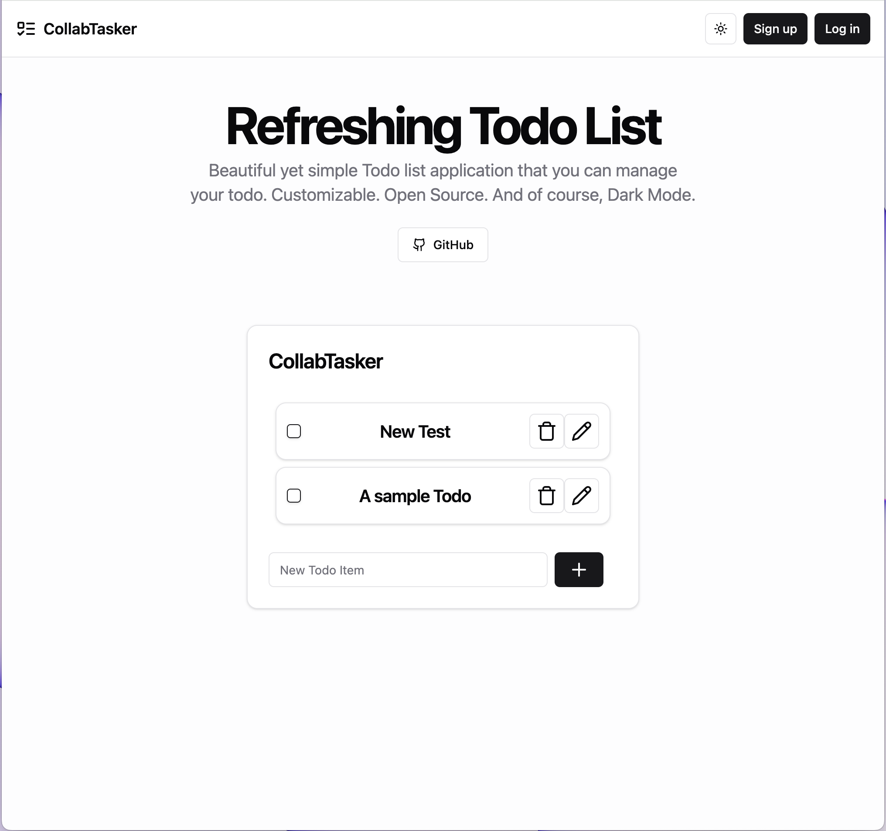
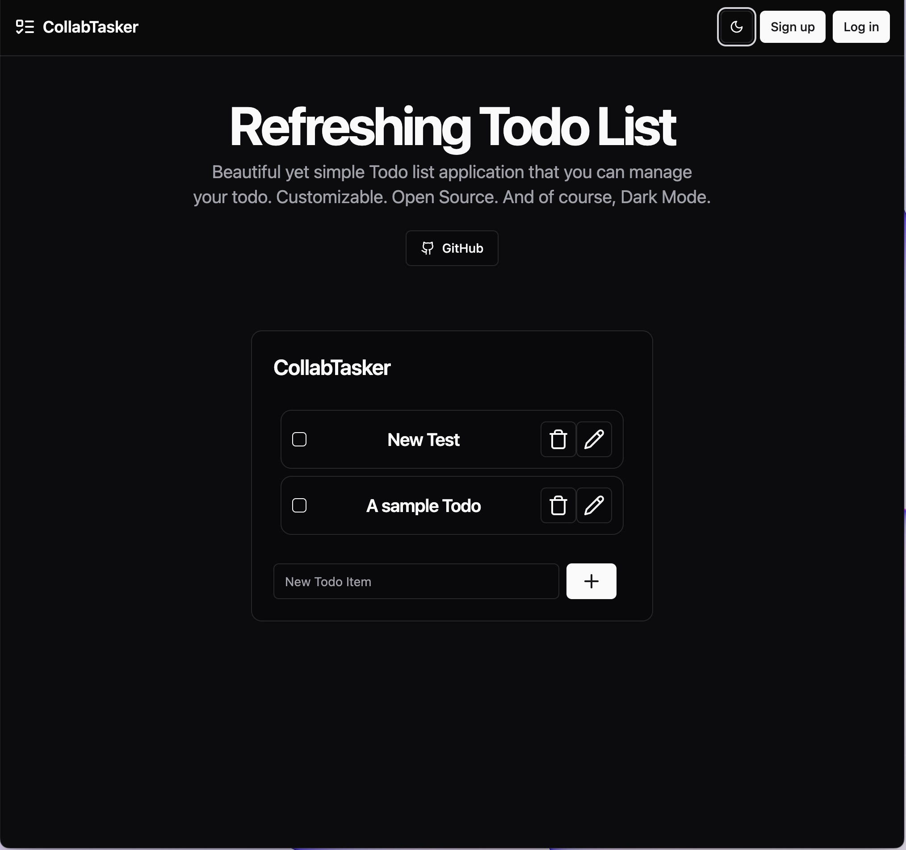

# Collabtasker
Collabtasker is a full stack web application for multiple users to add Todo items to their Todo boards.

## Demo link:
Access my site at the [project's github page](https://vulpesvulpes825.github.io/collabtasker/#/)

## About The App
Collabtasker is a full-stack web application that allows users to create and manage Todo items on personalized Todo boards. It offers functionality for users to share their boards with others, fostering a collaborative environment. 

## Technologies
I used `react.js`, `tailwindcss`, `typescript`, and `shadcn-ui` for my front end.
I used `Java`, `Spring Boot` for my back end.

## Screenshots

## Setup
- Download or clone the repository
- Have `pnpm`, `maven` and `openjdk` installed
- Run `pnpm install` and `maven install`
- Boot up the front end and back end
